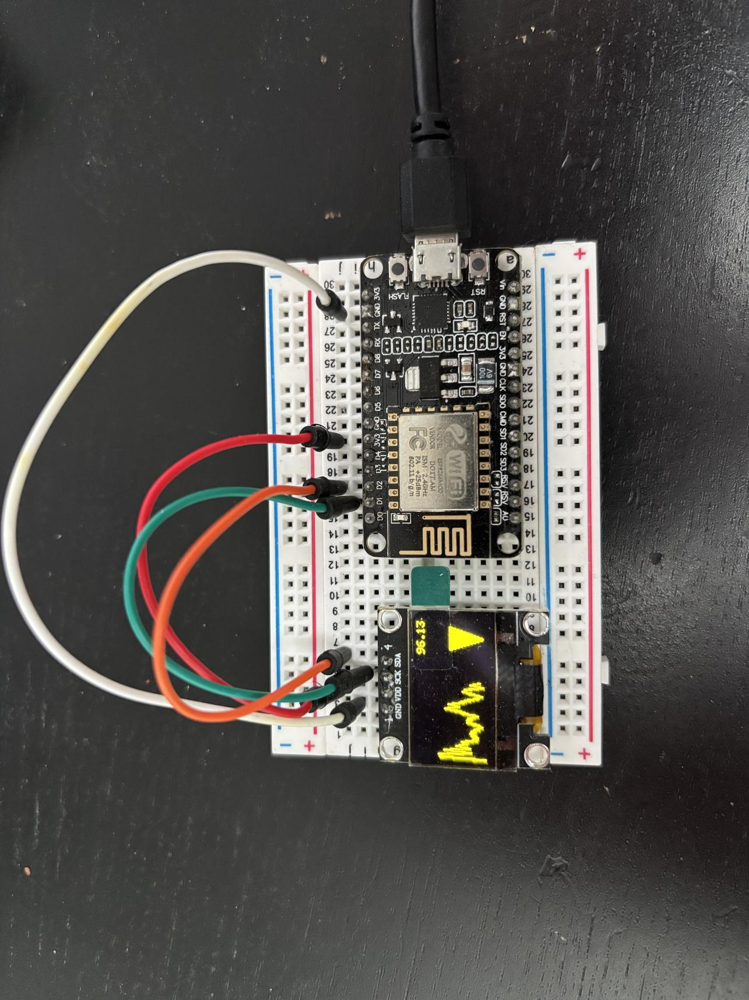

# ESP8266 electricity price

A weekend IoT project using PlatformIO and ESP8266 to display 
current electricity prices in the UK and their change over time.
Uses SSD1306 OLED for the actual display.

## Pin mapping

| SSD1306 | ESP8266 |
|---------|---------|
| GND     | GND     |
| VDD     | 3V3     |
| SCK     | D1      |
| SDA     | D2      |